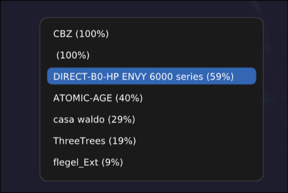
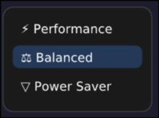

# hyprwat

A Hyprland menu utility to present selectable options with a customizable interface.

## Description

hyprwat creates a popup menu at your cursor position where you can select from a list of options. It also has built-in support for WiFi networks, audio devices, wallpapers, and custom menus. Custom menus can be defined using simple YAML configuration files.

## Features

- **Wayland native**: Built specifically for Wayland compositors
- **Hyprland integration**: Designed to work with Hyprland compositor
- **Cursor positioning**: Automatically appears at your current cursor position
- **WiFi selector**: Built-in support for selecting WiFi networks (via dbus and NetworkManager
- **Audio selector**: Built-in support for selecting audio input/output devices (via Pipewire)
- **Wallpaper selection**: Easily select a wallpaper from a directory of images (hyprpaper only)
- **Custom menus**: Define your own menus using simple YAML configuration files
- **Theming**: Customize the appearance with a configuration file

### Examples

#### WiFi Network Selector



#### Wallpaper Selector


#### Power Profile Selector



See the [examples](examples) directory for more.

## Installation

```
yay -S hyprwat
```
Or build from source (see Build Instructions below).

## Usage

```
hyprwat [OPTIONS] [id[:displayName][*]]...
```

### Command Line Arguments

You can pass a list of items directly as command-line arguments, where each item is a tuple in the form:

```
id[:displayName][*]
```

- `id`: Required identifier string (used internally)
- `displayName`: Optional label to show in the UI (defaults to id)
- `*`: Optional suffix to mark this item as initially selected

If no arguments are provided, hyprwat will read from stdin, expecting one item per line in the same format.

### Options

- `-h, --help`: Show help message
- `--input <hint>`: Show an input prompt instead of a selection menu with optional hint text
- `--password <hint>`: Show a password input prompt (masked input) with optional hint text
- `--audio`: Show audio input/output device selector (requires pipewire)
- `--wifi`:  Show WiFi network selection
- `--custom <file>`: Load a custom menu from a YAML configuration file
- `--wallpaper <dir>`: Select a wallpaper from the specified directory (for hyprpaper)


### More Examples

```bash
# Simple options with custom display names and pre-selection
hyprwat performance:Performance* balanced:Balanced powersave:PowerSaver

# Using stdin input
echo -e "wifi0:Home*\nwifi1:Work\nwifi2:Other" | hyprwat

# Input prompt
hyprwat --input "Enter Name"

# Password prompt
hyprwat --password "Enter Passphrase"

# WiFi network selection
hyprwat --wifi

# Audio device selection
hyprwat --audio

# Custom menu defined in yaml config files
hyprwat --custom ~/.config/hyprwat/menus/powermenu.yaml

# Wallpaper selection from a directory
hyprwat --wallpaper ~/.local/share/wallpapers

```
See the [examples](examples) directory for more.


## Theming
You can customize the appearance of the UI by modifying the configuration file located at `~/.config/hyprwat/hyprwat.conf`. The file uses a simple INI format to define colors and styles for various UI elements.

Example `hyprwat.conf`:

```ini
[theme]
font_color = #cdd6f4
font_path = ~/.local/share/fonts/MesloLGSDZNerdFont-Regular.ttf
font_size = 14.0
background_color = #1e1e2e
window_rounding = 10.0
frame_rounding = 6.0
background_blur = 0.95
hover_color = #3366b3ff
active_color = #3366b366
wallpaper_width_ratio = 0.8
```

## Build Instructions

### Dependencies

#### Arch Linux

```bash
sudo pacman -S cmake make gcc wayland wayland-protocols mesa fontconfig pkgconf libxkbcommon pipewire sdbus-c++
```

#### Debian/Ubuntu

```bash
sudo apt update
sudo apt install cmake make g++ libwayland-dev wayland-protocols \
                 libegl1-mesa-dev libgl1-mesa-dev libfontconfig1-dev \
                 pkg-config libxkbcommon-dev libsdbus-c++-dev libpipewire-0.3-dev
```

### Building

1. **Clone the repository**:
   ```bash
   git clone git@github.com:zackb/hyprwat.git
   cd hyprwat
   git submodule update --init --recursive
   ```

2. **Build the project**:
   ```bash
   # Debug build (default)
   make debug
   
   # Or release build
   make release
   ```

3. **Install** (optional):
   ```bash
   make install
   ```

### Manual Build with CMake

If you prefer to use CMake directly:

```bash
# Configure
cmake --preset debug
# or: cmake --preset release

# Build
cmake --build --preset debug
# or: cmake --build --preset release
```

## Development

### Project Structure

- `src/`: Main source code
  - `main.cpp`: Entry point and argument parsing
  - `ui.cpp`: User interface logic
  - `wayland/`: Wayland protocol implementations
  - `renderer/`: EGL/OpenGL rendering context
  - `selection/`: Selection/Menu handling logic and UI
  - `hyprland/`: Hyprland IPC integration
  - `audio/`: Pipewire audio device handling
  - `wifi/`: WiFi network handling via DBus and NetworkManager
  - `frames/`: UI frame components
  - `flows/`: UI flow definitions (select network -> input password)
- `ext/imgui/`: ImGui library (git submodule)
- `CMakeLists.txt`: Build configuration
- `Makefile`: Convenience build targets

## Integration Examples

### Power Profile Selector

The included `powerprofiles.sh` script demonstrates integration with powerprofilesctl:

```bash
#!/bin/bash

# Define profiles: id -> display name
declare -A profiles=(
    ["performance"]="⚡ Performance"
    ["balanced"]="⚖ Balanced"
    ["power-saver"]="▽ Power Saver"
)

# Get the current active profile
current_profile=$(powerprofilesctl get)

# Build hyprwat arguments
args=()
for id in "${!profiles[@]}"; do
    label="${profiles[$id]}"
    if [[ "$id" == "$current_profile" ]]; then
        args+=("${id}:${label}*")
    else
        args+=("${id}:${label}")
    fi
done

# Launch hyprwat and capture the selection
selection=$(hyprwat "${args[@]}")

# If user made a selection, apply it
if [[ -n "$selection" ]]; then
    powerprofilesctl set "$selection"
fi
```

### Passphrase Input Prompt
```bash
PASSPHRASE=$(hyprwat --input Passphrase)
echo $PASSPHRASE
```

## Requirements

- **Wayland compositor** (tested with Hyprland)
- **C++20 compatible compiler**
- **CMake 3.15+**
- **OpenGL/EGL support**
- **Fontconfig**
- **xkbcommon**
- **Pipewire**
- **sdbus-c++**


## Why?
I created hyprwat to fill a gap in the Wayland ecosystem for a simple, flexible, and visually appealing menu system that can be easily integrated into various use cases. Particularly, for waybar I needed a menu selection for wifi networks, power profiles, pavcontrol, etc. 

[My first attempt](https://github.com/zackb/code/tree/master/cpp/wat) used SDL2/3 and ImGui, but I didn't like the menu being a window (there's no layer shell support in SDL). So I rewrote it using pure Wayland protocols and EGL for rendering.

If nothing else a pretty cool [cpp wrapper for Wayland protocols](src/wayland).

As time passed I added more features and built-in selectors for things I couldn't find elsewhere. I didn't want to rice rofi to make a wallpaper selector, so I added that too (hyprpaper only)!

## License

[MIT](LICENSE)

## Contributing

Get at me on [GitHub](https://github.com/zackb) or [BlueSky](https://bsky.app/profile/zackzbz.bsky.social) if you have ideas, issues, or want to contribute!
